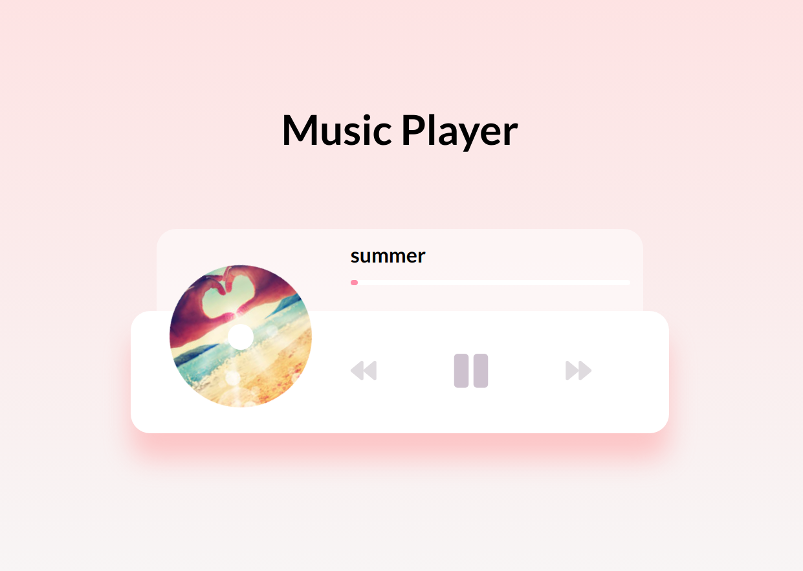

# music-player

Simple music player, built using vanilla JavaScript

### Functions:

[The app](https://tn-space.github.io/music-player/)

The app:

- play from the array of songs ['hey', 'summer', 'ukulele']
- can play previous or next song
- can pause, resume the song
- progress bar is updated as the song plays
- can play from a set progress bar

### Images:

